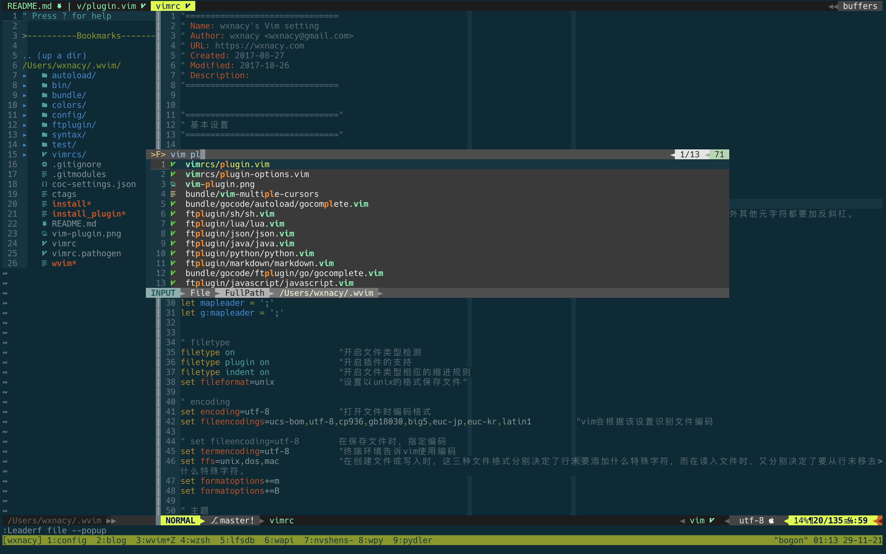

# wvim

`wvim` 可以快速集成 vim 开发环境。



<!-- TODO 安装字体 -->

## 安装

执行

```bash
$ curl -L https://raw.githubusercontent.com/wxnacy/wvim/master/install | bash
```

随后根据脚本提示完成操作即可使用。

## 代码补全

万物不全基于 YouCompleteMe

现阶段作为 Mac 系统下新系统适配最好，且最高大全的补全插件就是它了。

[Vim 插件 YouCompleteMe 代码自动补全](https://wxnacy.com/2017/09/22/vim-plugin-youcompleteme/)

### Go

```bash
$ go get -u github.com/mdempsky/gocode
$ vim ~/.bash_profile
export PATH=$PATH:$GOPATH/bin
$ source ~/.bash_profile
```

然后使用 `<c-x><c-o>` 即可完成自动补全

### Python

```bash
$ git clone --recursive https://github.com/davidhalter/jedi-vim.git ~/.vim/bundle/jedi-vim
$ pip install jedi
```

***注意***

- YouCompleteMe 使用当前系统默认 python 作为驱动，通常为 python3，如果三方包无法实现补全，需要使用 pip3 安装一次包才可以实现补全
- jedi 在使用 `<Leader>g` 进行代码跳转时，依赖 `jedi#environment_path` 参数指定 python 虚拟环境，如果使用 `pyenv` 可以指定参数为 `let g:jedi#environment_path = expand("$HOME/.pyenv/shims/python")`
